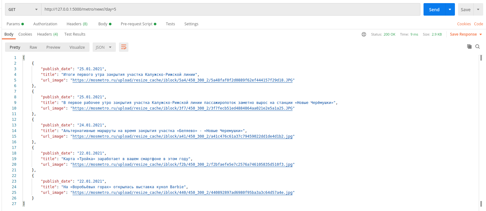

# Task

Написать API, которое получает новости за заданный период из базы, которую пополняет воркер
и парсер(воркер) который каждые 10 минут парсит новости
с сайта https://mosmetro.ru/press/news/
(достаточно будет просто взять те новости что есть 24 шт)
и сохраняет в базу с меткой когда эти новости спаршены,

пример метода
/metro/news?day=5

в качестве ответа вернуть JSON новости которые опубликованы за последний 5 дней (включительно)
заголовок
url картинки
дата публикации (YYYY-mm-dd)

время ответа должно быть ~1 секунду

что использовать
flask, docker + любая база

## Solution

- Run `run.sh` file
- After building containers check `http://127.0.0.1:5000/metro/news?day=5`

### Response from API

